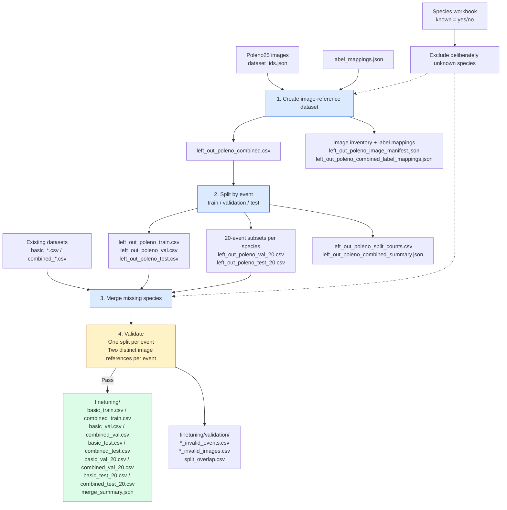

# Poleno CSV pipeline

Prepare image-reference CSVs for missing species and add them to existing datasets.
These tools do not copy images or train models. Run commands from the Holo_Datasets repository root or with pollen_datasets installed.
Install builder dependencies with `pip install -e ".[builder]"`.

## Prepare everything

```powershell
.\.venv\Scripts\python.exe -m pollen_datasets.dataset_builder.cordoba.training.prepare all `
  --images 'Z:\marvel\marvel-fhnw\data\Poleno25' `
  --datasets 'Z:\simon_luder\Data_Setup\Pollen_Datasets\data\final\poleno\cordoba_training' `
  --output data/prepared_poleno
```

The image folder supplies `dataset_ids.json`. Label mappings come from
`label_mappings.json` in the datasets' parent folder; override with `--labels PATH`.
`--species-workbook PATH` defaults to `poleno_monthly_species.xlsx`
beside the input datasets. A workbook is required; preparation fails if none is supplied.
Species exclusions are controlled entirely by the workbook: species marked
`known = no` are excluded regardless of `active`. There are no hardcoded exclusions.
Species marked `known = yes` or absent from the workbook are not excluded.
A species must have consistent `known` flags across its monthly rows.

Outputs stay in the selected output folder:
- `left_out_poleno_*.csv`: combined data, train/val/test, 20-event val/test subsets, and counts.
- JSON files: image inventory, label mappings, and creation summary.
- `finetuning/`: merged `basic_*` / `combined_*` CSVs, validation reports, and merge summary.

Use a fresh output folder for `all`; the output folder must not already exist.
Input datasets and source label mappings are preserved. Copy finished outputs to
shared storage only when needed.

## Workflow and output files

`python -m pollen_datasets.dataset_builder.cordoba.training.prepare all` runs the main workflow below. All generated
paths are relative to the selected `--output` folder.



Creation also validates events and image references and writes validation reports
beside the left-out CSVs. A validation failure leaves reports and partial files
for inspection and stops publication of the merged datasets. Only dataset variants
present in the input folder receive corresponding merged outputs.

## Optional steps

```powershell
python -m pollen_datasets.dataset_builder.cordoba.training.prepare inventory --datasets PATH --output data/species_inventory.csv
```

`inventory` reports species presence recursively, skipping archives; it does not
select species automatically. `all` always scans the current image folders and
species mapping, then creates and merges the datasets in one run. There is no
snapshot reuse or separate creation/merge command. Existing output folders are
refused; choose a new output path for each run, including after a failed run.

## Dataset rules

- Creation selects Cupressus sp., Cynosurus cristatus, Poaceae sp., Populus sp.,
  Quercus sp., Trisetum sp., and Ulmus sp. The list is in `_internal/create_left_out_poleno.py`.
- Rows reference images; every event must have exactly two rows across all labels
  within each output CSV, referencing two distinct nonblank image paths. During
  image inventory creation, whole events with counts other than two (or missing IDs)
  are dropped and recorded in `left_out_poleno_dropped_events.csv`. Duplicate
  image references and invalid merged datasets still stop preparation with reports.
  References are checked; merge does not open image files to verify their contents.
- Events stay together, with seed 42. Test receives `max(80, ceil(10%))` events per
  species, validation `max(20, ceil(5%))`, and training the remainder. At least one
  training event must remain. Validation/test subsets contain 20 events per species.
- Merge adds all rows for species absent from each original CSV, using its matching
  split. Species matching is exact; existing species are not topped up or rebalanced.
- Allowed original rows, columns, order, and label IDs are preserved. Additional
  image rows have blank particle measurements; event enumeration is local.
- Merge checks event isolation across every output, including basic/combined variants:
  an event may belong to only one of train, validation, or test. Validation/test
  subsets count as their parent role, so overlap with that parent is allowed.
- All merged CSVs are staged and validated before any final merged CSV is published.
  Validation failures leave reports and partial files; use a fresh folder to rerun.
  Creation outputs may already exist when merging fails. Publishing is sequential,
  so an interruption during final renames can still leave some finished files.
- Unknown species (`known = no`) are removed from all prepared splits, not just
  training. Keep a separate unknown-species evaluation dataset outside this workflow.

## Maintenance

These are separate from normal preparation. Audit is read-only; cleanup commands
replace selected CSVs and archive originals after verification.

```powershell
python -m pollen_datasets.dataset_builder.cordoba.training.maintenance.audit_event_row_counts PATH --output-dir data/event_audit
python -m pollen_datasets.dataset_builder.cordoba.training.maintenance.remove_audited_events PATH --audit-dir data/event_audit --staging-dir data/event_cleanup
python -m pollen_datasets.dataset_builder.cordoba.training.maintenance.remove_excluded_species PATH --staging-dir data/species_cleanup --species-workbook WORKBOOK
```

Audit scans top-level CSVs and reports invalid event counts without failing on
exceptions. Event cleanup removes whole invalid events and requires a matching
current audit; missing IDs require separate handling. Species cleanup scans the
selected folder and its `finetuning/` subfolder, rewriting only affected files.
Archived copies and old summary reports remain historical.

## Seasonal inference utilities

```powershell
python -m pollen_datasets.dataset_builder.cordoba.monthly_species WORKBOOK data/monthly_species.json
```

The monthly exporter selects active known species; `--include-unknown` selects
all active species. Prediction filtering remains in the Marvel_Unseen_Species_Filter repository; see
its `README_seasonal_inference.md` for inference usage.

Implementation helpers live in `_internal/`; use the public commands above.

## Internal modules

- `cordoba/_internal/species_workbook.py`: shared workbook parsing and flag validation.
- `_internal/event_splitting.py`: event-level splitting and subset sampling.
- `_internal/event_validation.py`: shared event counting, pair validation, and split isolation.
- `_internal/species_exclusions.py`: workbook-driven exclusion selection and filtering.
- `maintenance/_file_operations.py`: verified copying, backups, and replacement rollback.

Public commands and generated filenames remain unchanged. Monthly export now also
rejects inconsistent known flags across rows for the same species, matching training.

Invalid image-inventory events are removed before splitting: all rows for each
event with a count other than two are discarded, including repeated events across
species folders. Removal counts are recorded in the creation summary. Original
images and input CSVs remain unchanged. A species must still have enough retained
events for the configured split sizes.
